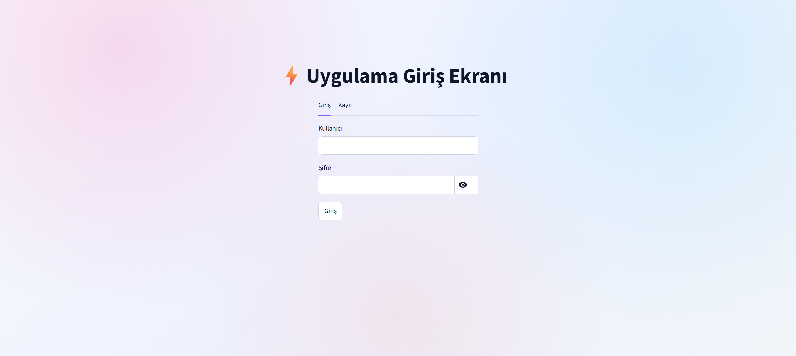
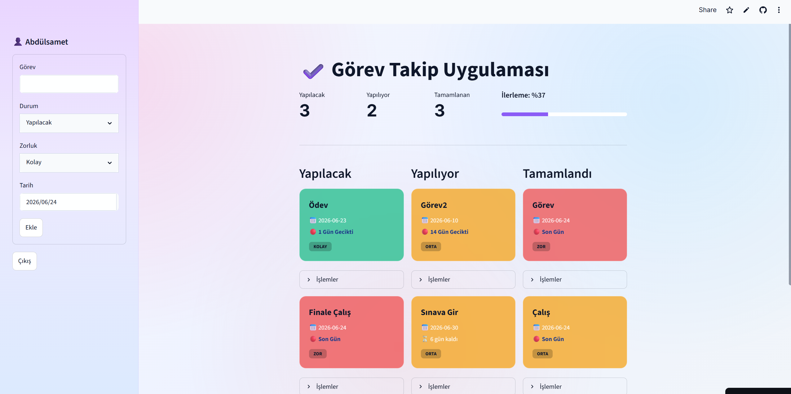
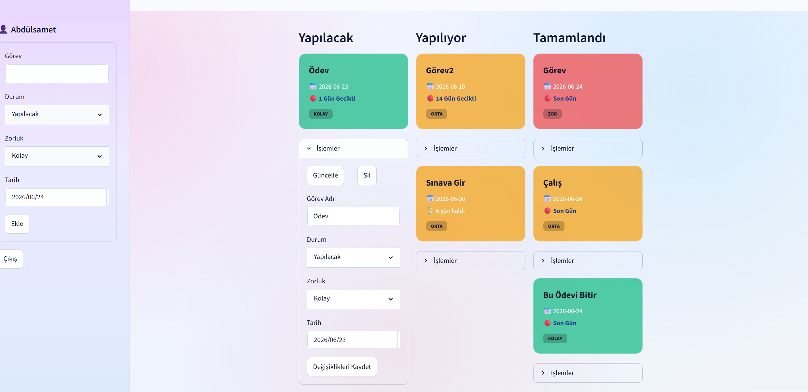

# ✔️ To-Do App

Google Sheets tabanlı, kullanıcı doğrulama sistemine sahip ve Streamlit ile geliştirilmiş görev takip uygulaması.

Kullanıcılar görevlerini oluşturabilir, güncelleyebilir, silebilir ve ilerleme durumlarını takip edebilir. Tüm veriler Google Sheets üzerinde saklanır ve kullanıcılar yalnızca kendi görevlerine erişebilir.

---

## 🚀 Canlı Uygulama

Uygulamayı aşağıdaki bağlantı üzerinden kullanabilirsiniz:

**🔗 Canlı Uygulama:**
https://todo-app-abdulsamet.streamlit.app/

---

## 📊 Akış Şeması ve Sistem Mimarisi

Uygulamanın mimari yapısı ve iş akışları aşağıdaki diyagramda gösterilmektedir.

[📄 Akış Şemasını Görüntüle](docs/Todo_Streamlit.drawio.png)

---

## 📷 Ekran Görüntüleri

### Giriş Ekranı



### Görev Yönetim Paneli



### Görev Güncelleme İşlemi



---

## ✨ Özellikler

* Kullanıcı kayıt sistemi
* Kullanıcı giriş sistemi
* SHA256 ile parola hashleme
* Görev ekleme
* Görev güncelleme
* Görev silme
* Son tarih takibi
* Görev zorluk seviyesi yönetimi
* Görev durum yönetimi
* Görev ilerleme takibi
* Çok kullanıcılı yapı
* Google Sheets tabanlı veri saklama
* Modern ve kullanıcı dostu arayüz

---

## 📖 Nasıl Kullanılır?

1. Uygulamayı açın.
2. Hesabınız yoksa **Kayıt** sekmesinden yeni bir kullanıcı oluşturun.
3. Kullanıcı adı ve şifreniz ile giriş yapın.
4. Sol taraftaki formu kullanarak yeni görev oluşturun.
5. Görev için:

   * Görev adı girin
   * Durum seçin
   * Zorluk seviyesi belirleyin
   * Son tarih seçin
6. **Ekle** butonuna basarak görevi kaydedin.
7. Görevler durumlarına göre üç sütunda görüntülenir:

   * Yapılacak
   * Yapılıyor
   * Tamamlandı
8. Her görev kartının altındaki **İşlemler** bölümünden:

   * Görevi güncelleyebilir
   * Görevi silebilirsiniz
9. Üst bölümde yer alan metrikler sayesinde:

   * Yapılacak görev sayısını
   * Devam eden görev sayısını
   * Tamamlanan görev sayısını
   * Genel ilerleme yüzdesini takip edebilirsiniz
10. İşiniz bittiğinde **Çıkış** butonunu kullanarak oturumu sonlandırabilirsiniz.

---

## ⚙️ Kurulum

### 1. Repoyu Klonlayın

```bash
git clone https://github.com/AbdulsametDogru/To-Do-App.git
cd To-Do-App
```

### 2. Gerekli Paketleri Kurun

```bash
pip install -r requirements.txt
```

### 3. Google Cloud Yapılandırması

1. Google Cloud Console üzerinde bir proje oluşturun.
2. Google Sheets API'yi etkinleştirin.
3. Bir Service Account oluşturun.
4. Service Account için JSON anahtarı oluşturun.
5. Kullanacağınız Google Sheets dosyalarını Service Account e-posta adresi ile paylaşın.

### 4. Streamlit Secrets Dosyasını Oluşturun

`.streamlit/secrets.toml`

```toml
[gcp_service_account]
type = "service_account"
project_id = "YOUR_PROJECT_ID"
private_key_id = "YOUR_PRIVATE_KEY_ID"
private_key = "YOUR_PRIVATE_KEY"
client_email = "YOUR_CLIENT_EMAIL"
client_id = "YOUR_CLIENT_ID"
token_uri = "https://oauth2.googleapis.com/token"
```

### 5. Google Sheets Kimliklerini Güncelleyin

`database.py` dosyasında bulunan aşağıdaki değişkenleri kendi tablolarınıza göre düzenleyin:

```python
TASKS_SHEET_ID = "YOUR_TASKS_SHEET_ID"
USERS_SHEET_ID = "YOUR_USERS_SHEET_ID"
```

### 6. Uygulamayı Başlatın

```bash
streamlit run App.py
```

---

## 📂 Proje Yapısı

```text
To-Do-App/
│
├── App.py
├── Backend.py
├── auth.py
├── database.py
├── requirements.txt
├── README.md
│
└── docs/
    ├── Todo_Streamlit.drawio.png
    ├── login.png
    ├── dashboard.png
    └── update-task.png
```

---

## 🏗️ Sistem Mimarisi

### App.py

Kullanıcı arayüzünü ve uygulama akışını yönetir.

### Backend.py

Görev oluşturma, güncelleme, silme ve sıralama işlemlerini gerçekleştirir.

### auth.py

Kullanıcı kayıt ve giriş işlemlerini yönetir.

### database.py

Google Sheets ile veri alışverişini gerçekleştirir.

---

## 🛠️ Kullanılan Teknolojiler

* Python
* Streamlit
* Google Sheets API
* GSpread
* Google Authentication
* SHA256

---

## 🔒 Güvenlik

* Şifreler SHA256 algoritması ile hashlenmektedir.
* Ham şifreler veritabanında saklanmaz.
* Kullanıcılar yalnızca kendi görevlerini görüntüleyebilir.
* Google Service Account ile güvenli erişim sağlanmaktadır.

---

## 👨‍💻 Geliştirici

**Abdülsamet Doğru**

GitHub: https://github.com/AbdulsametDogru

